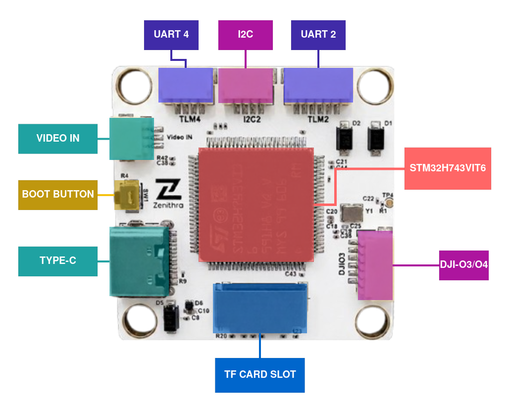
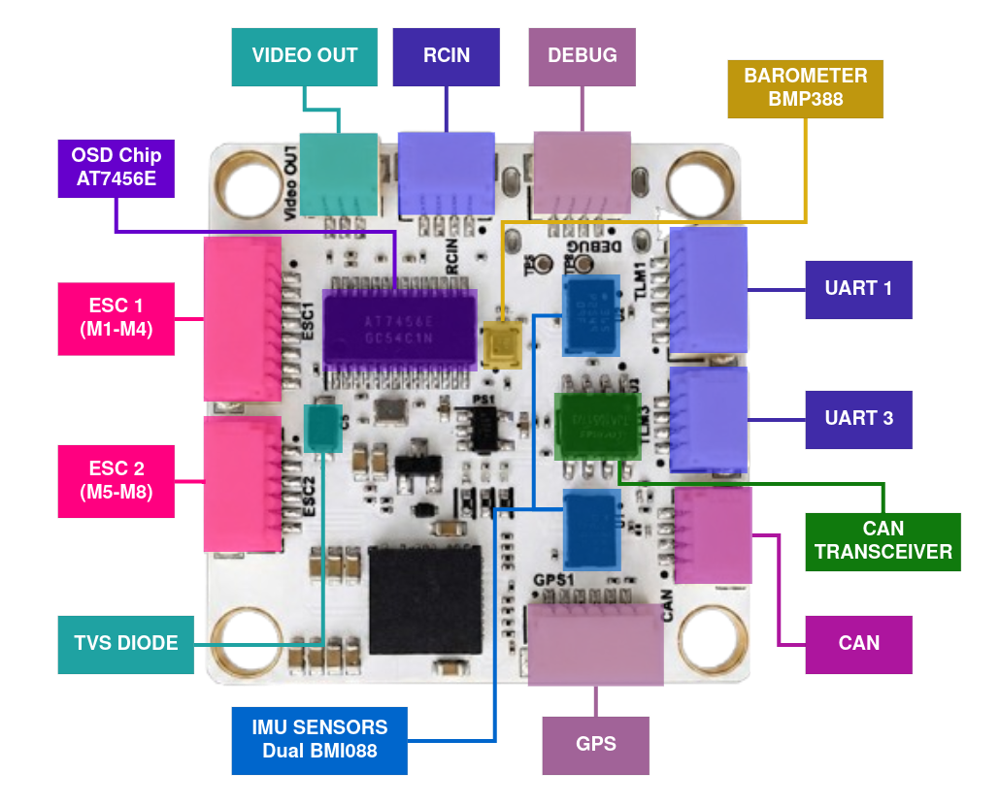
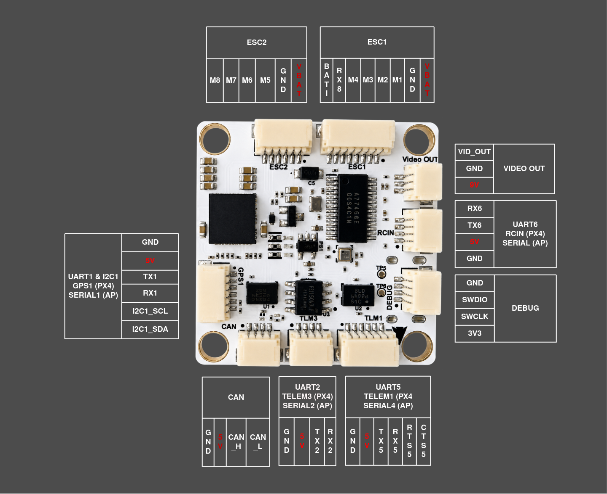

# ZenFC H743 Flight Controller

The _ZenFC H743_ is a flight controller designed by [Zenithra Tech](https://www.zenithratech.com/contact).
It is built around the STM32H743 processor with dual Bosch BMI088 IMUs for sensor redundancy, an onboard barometer, and an integrated OSD.

  

## Features

- **MCU:**
  - STM32H743VIT6 (32-bit Arm® Cortex®-M7, 480 MHz)
- **IMU:**
  - 2x Bosch BMI088 (accel + gyro, independent SPI buses for redundancy)
- **Barometer:**
  - Bosch BMP388
- **OSD:**
  - Onboard AT7456E OSD chip
- **Interfaces:**
  - 7x UARTs
  - 1x CAN
  - 2x external I2C (I2C1 with GPS connector for compass and dedicated I2C2 connector)
  - 8x PWM outputs (Dshot supported)
  - microSD card slot
  - 1x USB Type-C
  - 1x SWD (Debug)
- **Power:**
  - 2x ADC (V_BAT & current sense)
  - Battery Input range - 2S-6S
  - BEC Outputs
    - 9V 3A cont.
    - 5V 3A cont.

## Dimensions

  

- **Mounting:** 30.5 mm x 30.5 mm /Φ4mm hole
- **Dimensions:** 35mm x 35mm x 8mm
- **Weight:** 9g

## Where to Buy

Order from [Zenithra Tech](https://www.zenithratech.com/solutions/components).

## Layout

  

  

## UART Mapping

| SERIAL Port | UART Interface | Label / Function     | Flow Control |
|-------------|----------------|----------------------|---------------|
| SERIAL0     | -              | USB                  | -             |
| SERIAL1     | USART1         | GPS1                 | No            |
| SERIAL2     | USART2         | User configured      | No            |
| SERIAL3     | USART3         | User configured      | No            |
| SERIAL4     | UART5          | TELEM1/MAVLink2      | Yes           |
| SERIAL5     | USART6         | RCIN                 | No            |
| SERIAL6     | UART7          | TELEM2/MAVLink2      | Yes           |
| SERIAL7     | UART8          | ESC Telemetry        | No            |

## Connectors & Pinout

Board uses JST SH connectors for all interfaces.

  

  

## RC Input

The UART6 is compatible with all ArduPilot supported receiver protocols,

- SBUS/DSM/SRXL connects to the RX6 pin.

- CRSF also requires a TX6 connection, in addition to RX6, and automatically provides telemetry.

- FPort requires connection to TX6 . See FPort Receivers.
  
- SRXL2 requires a connection to TX6 and automatically provides telemetry. Set SERIAL5_OPTIONS to "4".

- PPM is not supported.
  
Any UART can also be used for RC system connections in ArduPilot and is compatible with all protocols except PPM. See Radio Control Systems for details.

## OSD Support

The ZenFC H743 supports onboard OSD using OSD_TYPE 1 (MAX7456 driver). Simultaneously, DisplayPort OSD is available on the HD VTX connector, set OSD_TYPE2 = "5".

## VTX Support

The SH1.0-6P connector supports a DJI Air Unit / HD VTX connection. Protocol defaults to DisplayPort.

## PWM Output

The ZenFC H743 supports up to 8 PWM outputs.

All the channels support DShot.

Channels 1-6 and 8 support bi-directional DShot.

PWM outputs are grouped and every group must use the same output protocol:

1, 2, 3, 4 are Group 1;

5, 6 are Group 2;

7, 8 are Group 3;

## Battery Monitoring
The voltage sensor can handle up to 6S LiPo batteries.

The default battery parameters are:

- BATT_MONITOR 4
- BATT_VOLT_PIN 8
- BATT_CURR_PIN 4
- BATT_VOLT_MULT 10.09
- BATT_AMP_PERVLT 40

**Note**: These default multipliers are starting values. Since the current sensor is external (located on the ESC connector), you must adjust `BATT_VOLT_MULT` and `BATT_AMP_PERVLT` according to your specific current sensor's characteristics.

## Loading Firmware

Initial firmware load can be done with DFU by plugging in USB with the bootloader button pressed. Then you should load the "with_bl.hex" firmware, using your favorite DFU loading tool.

Once the initial firmware is loaded you can update the firmware using any ArduPilot ground station software. Updates should be done with the "\*.apj" firmware files.
